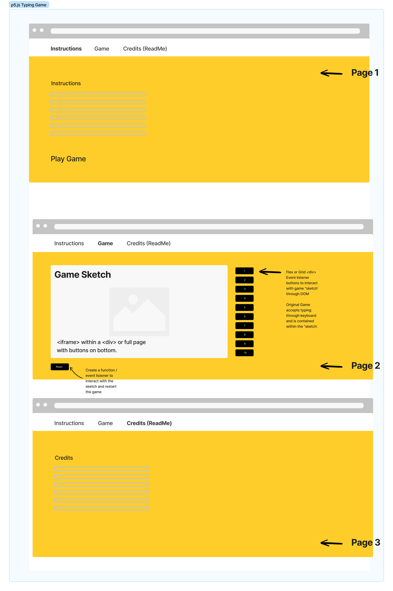
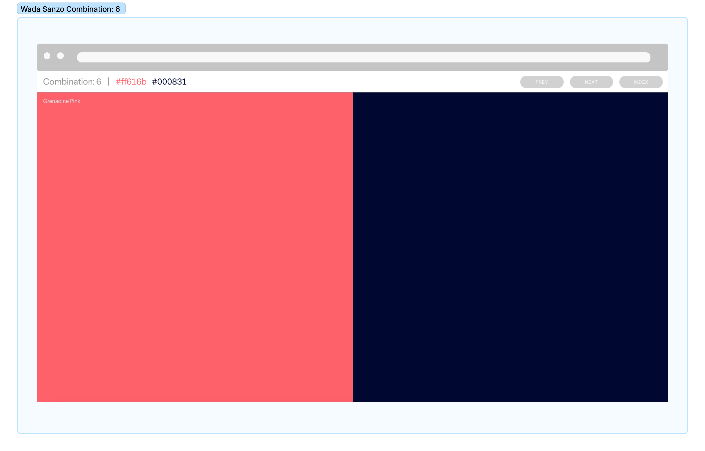

<!-- MARKDOWN PRIMER -->
<!-- https://meakaakka.medium.com/a-beginners-guide-to-writing-a-kickass-readme-7ac01da88ab3 -->

# MATCH THAT NUMBER
MATCH THAT NUMBER is a typing game written using the [p5.js](https://p5js.org) library. where the player needs to try and match the number that projects out from the game board by typing the correct key on the keyboard before the next number comes up. You score by getting a match. You "strike" by typing the wrong number. Three strikes, and you're out. GAME OVER.

## Motivation
There were three main goals for this project. The first, and most important, was to reinforce, practice, and work towards fluency in core JavaScript concepts. 

The second was to do so in a way that matched my strengths and sensibilities p5.js, as defined on the first line of its website, is: "a JavaScript library for creative coding, with a focus on making coding accessible and inclusive for artists, designers, educators, beginners, and anyone else!" More about the history of the library and its predecssor, Processing, [here](https://cathyatseneca.gitbooks.io/introduction-to-p5-js/content/chapter1.html#).

The third motivation was to stretch myself and create something I was both excited for and scared of (because it was ambitious).

## Build status
This is build 0.7. 
The software works, but there are a few intended features that are not there. Read more under the Roadmap heading.

## Code style
This project is written using the [p5.js](https://p5js.org) library and primarily coded using its [online code editor](https://editor.p5js.org), which allows a user to be "up and running" trying sketches—which is how p5.js programs are referred to—in seconds.

p5.js has its own functions, order of operations, and rules, but it is built on JavaScript, so JavaScript still works within it and outside it.

## Images/Wireframe
### Project Wireframe
Below is the original seed idea for how this project would look in its web presence. The current version is a single page. See plans for extension under Roadmap. 

## Tech/framework used
### Built with
[p5.js](https://p5js.org) 

### Styled with
[Tachyons](https://tachyons.io) CSS framework. 

The motto on its homepage is: 
#### Built for designing.
"Create fast loading, highly readable, and 100% responsive interfaces with as little css as possible." Tachyons styles HTML elements using classes and its own CSS components.

### Design
The color scheme for the project is [Combination 6](https://sanzo-wada.dmbk.io/combination/6) (Grenadine Pink and Deep Indigo) from [Wada Sanzo's](https://sanzo-wada.dmbk.io/about) [Dictionary of Color Combinations](https://en.seigensha.com/books/978-4-86152-247-5/).

## Roadmap
+ Implement buttons on DOM that interact with the game sketch. In lieu of typing. Also mobile-friendlier.
+ Fix random color generator so that on each 'hit' or match, a different color flashes up.
+ After playing multiple times, modify game to 20 rounds & change win and lose amounts.
+ Fix CSS bugs and work towards matching layout and design.
+ Create and style new pages to match the original wireframe concept.
+ More to be added...

## Contribute
Let people know how they can contribute into your project. A contributing guideline will be a big plus.

## Credits
To learn p5.js I used the [LinkedIn Learning](https://www.linkedin.com/learning/?u=116852650) platform and [Chicago Public Library's](https://www.chipublib.org) subscription to the service. I'm so grateful for both.

[Daniel Schiffman](https://thecodingtrain.com/about) is the educator and developer behind [The Coding Train](https://thecodingtrain.com). I looked at many of his resources and watched some of his demonstrations. 

[Kevin Workman](https://happycoding.io/about/) of [Happy Coding](https://happycoding.io) had a very [useful page](https://happycoding.io/tutorials/p5js/web-dev) that demonstrated how to place my p5 game sketch onto my webpage by using the DOM and manipulating the setup() function within my p5 sketch.

I also referred to the [Reference section](https://p5js.org/reference/) on p5.js's website often, especially when creating a random color variable that I used to give the user feedback on successful matches while playing the game.

Thank you Ben Fry and Casey Reas, the creators of [Processing](https://processing.org), a Java-based [Library](https://en.wikipedia.org/wiki/Processing) upon which p5.js is based. Read more about its history [here](https://medium.com/processing-foundation/a-modern-prometheus-59aed94abe85)

As mentioned above, design thinking and execution were simplified and expedited with the aid of [Tachyons](https://tachyons.io) and Wada Sanzo's [Dictionary of Color Combinations](https://en.seigensha.com/books/978-4-86152-247-5/), or better, the [site](https://sanzo-wada.dmbk.io) that [Dain Kim](https://dain.kim) makes the book's color harmonies available to anyone, anywhere through the internet.

## License
2023 (c) Copyright Andrew Doak [mrandrewdoak@gmail.com](mailto:mrandrewdoak@gmail.com)
